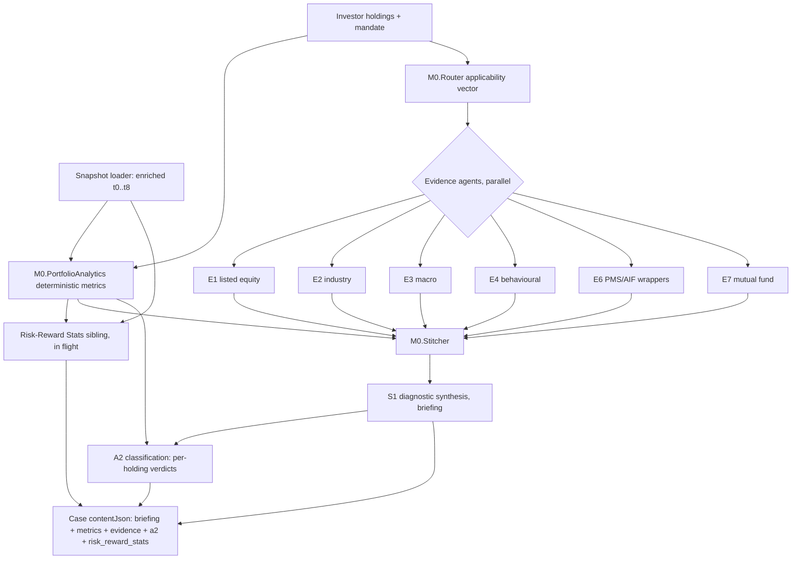

# Samriddhi AI (Lean MVP)

An agentic AI decision-support platform for wealth advisory, currently in the Lean MVP build phase, targeting Indian HNI wealth advisors. It turns a portfolio plus an investor mandate into an evidence-backed, audit-defensible diagnostic that an advisor can carry into a client meeting. The build is legibility-first: the codebase carries its own reasoning (decisions, working agreements, debt, and audits are all in-repo), so a future review is a query against existing records, not archaeology.

## Data Setup

The **market snapshot and sector data** this pipeline reads are real-world-sourced (licensed from vendors / curated from exchanges without redistribution rights) and proprietary-edge, so they are not tracked in this repository. They live in a private companion repo, [`ArthaSamriddhiAI/Samriddhi-AI-Data-Snapshots`](https://github.com/ArthaSamriddhiAI/Samriddhi-AI-Data-Snapshots), published as versioned GitHub release assets, and the release this repo expects is pinned in `data-version.txt`. Everything else the pipeline needs is already in-repo: the six investor archetypes are fictional, so their holdings and mandates (`db/fixtures/structured-*.ts`) and the hand-authored Sharma evidence verdicts (`db/fixtures/raw/`) are tracked here and need no setup. See ADR-0027 (`docs/decisions/0027_snapshot_data_access_via_private_releases.md`) for the privacy boundary and access model.

First-time setup after cloning:

1. Install dependencies: `npm install`.
2. Install the GitHub CLI (`gh`) and authenticate: `gh auth login`.
3. Ensure your GitHub account has read access to the private data repo. If it does not, request access from Shubham.
4. Fetch the data: `npm run setup-data`. This reads `data-version.txt`, downloads that release's assets, verifies each against the release manifest (SHA256), and copies them to the paths the code expects (`fixtures/snapshots/enriched/` and `scripts/sector_map.json`). The fetched files are git-ignored and never re-enter version control.
5. Initialise and seed the local store: `npm run db:push` then `npm run db:seed`.

After that, the usual commands (`npm run dev`, the `scripts/_verify-*.ts` checks, etc.) work normally. Re-run `npm run setup-data` whenever `data-version.txt` changes.

## Samriddhi 1 vs Samriddhi 2

Two distinct case modes.

- **Samriddhi 1**, suitability evaluation and proposal generation ("what should we do"). Scoped down for the Lean MVP; the proposed-action path exists in code but S1 suitability is deferred to a future workstream.
- **Samriddhi 2**, portfolio analysis and proposed-action evaluation ("what does the portfolio say"). The canonical case mode for the Lean MVP and what the Capability Phase workstreams build against.

## Architecture at a glance

The target system (per the foundation document) is layered: data ingestion, evidence agents, a context layer, synthesis, challenge and governance, decision, and monitoring. The Lean MVP ships a deliberate subset of that target. There is no canonical architecture diagram checked into the repo yet; the authoritative records are the ADRs in `docs/decisions/` and the slice plan in `docs/BUILD_ROADMAP.md`. The flowchart below is the actual Samriddhi 2 diagnostic pipeline as wired in `lib/agents/pipeline.ts`.

The proposed-action path (`lib/agents/pipeline-case.ts`, `routeProposedAction`) and the IC1 investment-committee roles exist in-repo but sit outside the canonical Lean S2 diagnostic flow. The foundation's full target architecture also names a governance series and a monitoring agent (PM1); those are conceptual targets not built in the Lean MVP and are intentionally absent from the inventory below, which lists only what exists in-repo.

## Agent inventory

Skill / prompt markdown lives in `agents/<snake_case>.md`; TypeScript implementations live in `lib/agents/<kebab-case>.ts`. Some agents are skill-only in the Lean MVP (no implementation wired yet); this is noted explicitly.

**M0 context layer**

- `m0_boss` (`agents/m0_boss.md`), orchestration-policy skill. Skill only.
- `m0_router` (`agents/m0_router.md`, `lib/agents/router.ts`), deterministic applicability-vector dispatch: which evidence agents fire.
- `m0_stitcher` (`agents/m0_stitcher.md`, `lib/agents/stitcher.ts`), deterministic bundling of metrics plus evidence into the context S1 consumes.
- `m0_indian_context` (`agents/m0_indian_context.md`, `lib/agents/m0-indian-context.ts`), India-specific tax / regulatory / lock-in framings from a curated YAML store.
- `m0_portfolio_risk_analytics` (`agents/m0_portfolio_risk_analytics.md`), the interpretive six-dimension financial-risk verdict skill (provisional, cluster-7). Its deterministic feeder is `lib/agents/portfolio-risk-analytics.ts` (`computeMetrics`: concentration, liquidity, asset-class bands, cash deployment), referred to as M0.PortfolioAnalytics in skill nomenclature.
- **Risk-Reward Stats** (in flight, this workstream), sibling to the deterministic feeder. Produces per-holding, per-sleeve, per-portfolio risk-adjusted stats; feeds Dimension 4 of the interpretive verdict skill when that ships. Skill `agents/risk_reward_stats.md` and `lib/agents/risk-reward-stats.ts` land during this workstream.

**Evidence agents (E1-E7)**

- `e1_listed_fundamental_equity` (`agents/e1_listed_fundamental_equity.md`, `lib/agents/e1-listed-equity.ts`), per-stock listed-equity fundamental and thesis read.
- `e2_industry_business` (`agents/e2_industry_business.md`, `lib/agents/e2-industry.ts`), industry and business-quality read.
- `e3_macro_policy_news` (`agents/e3_macro_policy_news.md`, `lib/agents/e3-macro.ts`), macro and policy context. Mandatory on every diagnostic.
- `e4_behavioural_historical` (`agents/e4_behavioural_historical.md`, `lib/agents/e4-behavioural.ts`), stated-versus-revealed behavioural signal.
- `e5_unlisted_equity` (`agents/e5_unlisted_equity.md`), unlisted-equity scope. Skill only; activates only if in-scope unlisted equity exists.
- `e6_pms_aif_sif` (`agents/e6_pms_aif_sif.md`, `lib/agents/e6-wrappers.ts`), PMS / AIF wrapper read, including complexity-premium evaluation.
- `e7_mutual_fund` (`agents/e7_mutual_fund.md`, `lib/agents/e7-mutual-fund.ts`), mutual-fund scheme read.

**Challenge, classification, synthesis, committee**

- `a1_challenge` (`agents/a1_challenge.md`), synthesis-challenge skill. Skill only in the Lean MVP.
- `a2_classification` (`agents/a2_classification.md`, `lib/agents/a2-classification.ts`), per-holding meeting-behaviour verdict (Maintain / Monitor / Discuss / Review). Two-layer: deterministic Layer 1, LLM Layer 2. Shipped (Slice 4.6a).
- `s1_diagnostic_mode`, `s1_case_mode`, `s1_briefing_mode` (`agents/s1_*.md`, `lib/agents/s1-diagnostic.ts`, `lib/agents/pipeline-case.ts`), the seven-section briefing synthesis for S2 cases.
- `ic1_chair`, `ic1_counterfactual_engine`, `ic1_devils_advocate`, `ic1_minutes_recorder`, `ic1_risk_assessor` (`agents/ic1_*.md`, `lib/agents/ic1/`, `lib/agents/ic1-pipeline.ts`), investment-committee simulation roles.

**Shared deterministic modules** (`lib/agents/`, no skill): `snapshot-loader.ts` (enriched snapshot read plus typed shape), `harness.ts` (the single `callAgent` LLM entrypoint), `skill-loader.ts`, `materiality.ts`, `proposal.ts`, `listed-equity-scope.ts`, `wrapper-scope.ts`, `stub.ts`.

## Codebase orientation

- `agents/`, skill and prompt markdown (one file per agent; some agents have a subfolder for knowledge stores).
- `lib/agents/`, TypeScript implementations and the deterministic modules.
- `db/fixtures/`, structured holdings, mandates, and the S2 case fixtures (`db/fixtures/cases/`).
- `fixtures/snapshots/enriched/`, the canonical t0..t8 snapshot suite (the loader reads here; the pre-enrichment source dir is a temporary rollback path during the risk-reward workstream).
- `scripts/`, ingestion and enrichment utilities plus the `_verify-*.ts` deterministic verify scripts (the project's test convention; there is no separate test runner).
- `app/`, `components/`, the Next.js UI.
- `db/`, `prisma/`, the SQLite-backed case and investor store.
- `foundation/`, the product foundation reference data.
- `docs/`, all in-repo reasoning. Subfolders: `decisions/` (ADRs), `audits/` (per-workstream audit docs), `workstreams/` (cross-workstream hand-off and PR docs), `working_agreements/` (one file per working agreement), `debt/` (the debt logs), `reference/` (build-context docs), `slices/` (per-slice build notes); the `docs/` root is orientation-only.

## Vocabulary

- **ADRs.** Architecture Decision Records. Filename-numbered (`0001`, `0002`, and onward). Live in `docs/decisions/`. Each captures one load-bearing decision: context, alternatives considered, consequences. Reference ADRs by filename (internal title numbers diverge from filenames for the snapshot-enrichment set).
- **Working Agreements (WAs).** Pre-specified rules for how the AI agents and the product owner collaborate. Live in `docs/working_agreements/` (one file per WA: agreement, rationale, trigger, examples, cross-references; `README.md` is the index). Reading them is mandatory before making changes; non-engineering humans-in-the-loop should start here.
- **Sentinels.** Labelled placeholders in data records meaning "this slot is intentionally not filled, here is why" (a vocabulary for honest gaps). Examples: `opaque_wrapper`, `benchmark_not_in_snapshot`, `pms_disclosure_limited`. Sentinel taxonomies are defined in the relevant ADRs.
- **Debt logs.** Captured trade-offs and deferrals. Live in `docs/debt/`. Series: P (product-stance), T (technical), D (data-quality), DD (production data debt), O (operational / forward-audit); render-layer debt is in `docs/debt/ui_ux_debt_log.md`.
- **Audit docs.** Per-workstream institutional-memory records. Live in `docs/audits/`. Each captures the audit findings, design decisions, and calibrations of one workstream's execution.
- **Hand-off docs.** Cross-workstream interface documents. Live in `docs/workstreams/`. Each captures what a workstream shipped and what downstream workstreams need to know (dual-written with the audit doc per WA11).

## Current state

A2 classification (Slice 4.6a) and Snapshot Data Enrichment have shipped to `main`. The Capability Phase is in progress; Risk-Reward Statistics is the in-flight workstream (the second of five capabilities). The full slice-by-slice plan and what remains is in `docs/BUILD_ROADMAP.md`; the deferred backlog is in `docs/reference/DEFERRED.md`.

## For contributors

Decisions are made through a small set of durable artifacts. Working agreements (`docs/working_agreements/`) are the rules of engagement; read them first. Load-bearing decisions land as ADRs (`docs/decisions/`) as they are made, not retrospectively. Honest deferrals and trade-offs go in the debt logs (`docs/debt/`) rather than expanding a workstream's scope. The principle throughout is legibility-first: the codebase carries its own reasoning so the periodic Slice 7 audit is a query against existing records, not reconstruction.

Slice 7 polish candidates (noted here so they are not lost): README typography refinement, an agent-inventory completeness check against the post-Slice-7 codebase, and vocabulary expansion as new debt or sentinel categories accrue.
